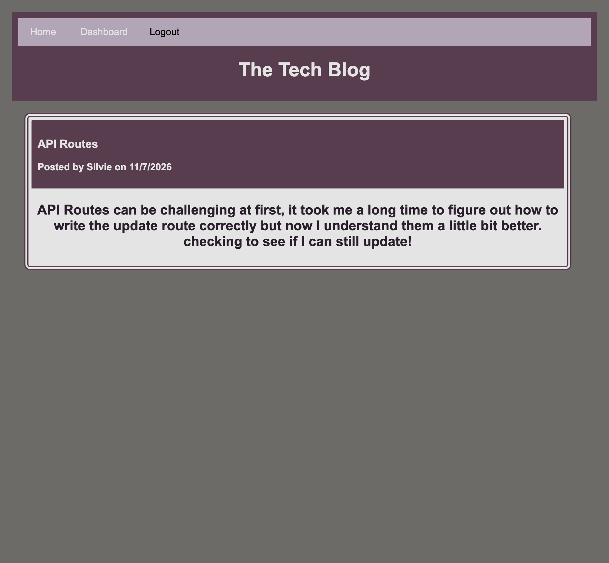

# Homework 14: tech-blog

## Table of Contents
* [Description](#description)
* [Installation](#installation)
* [Usage](#usage)
* [License](#license)
* [Contributing](#contributing)
* [Questions](#questions)
* [Link-To-Deployed-Code](#link-to-deployed-code)
  
## Description
The objective of this assignment was to create a Tech Blog in which a user can create, update and delete posts after they have logged in. The user can also comment and read the posts other users created. 

To start, I created a schema and model for 3 tables: users, posts, and comments. Next, I created created the routes to Create, Read, Update and Delete the data that they users created. Then, I built handlebars to manage the data that was sent to each page of my website and wrote the script files for telling the application how to store, update or read the data to the database. Finally, I created a stlye.css document to style my website.  

## Installation
Clone the project to your local computer than run an npm install.

## Usage
To use this project, type "node server.js" in your terminal and then open your web browser and enter 'localhost:3001' to start running the application. 

## License
This project is licensed through MIT.

## Contributing
Please reach out to me if you would like to contribute to my project by email.

## Questions
If you have any questions, please contact me at sjobergkarna@gmail.com or on GitHub with this link [kesjoberg](https://github.com/kesjoberg).

## Screenshot of my deployed paged

## Link to GitHub Repository
https://github.com/kesjoberg/tech-blog

## Link to Deployed Code
https://kesjoberg-tech-blog.herokuapp.com/
 
# tech-blog
